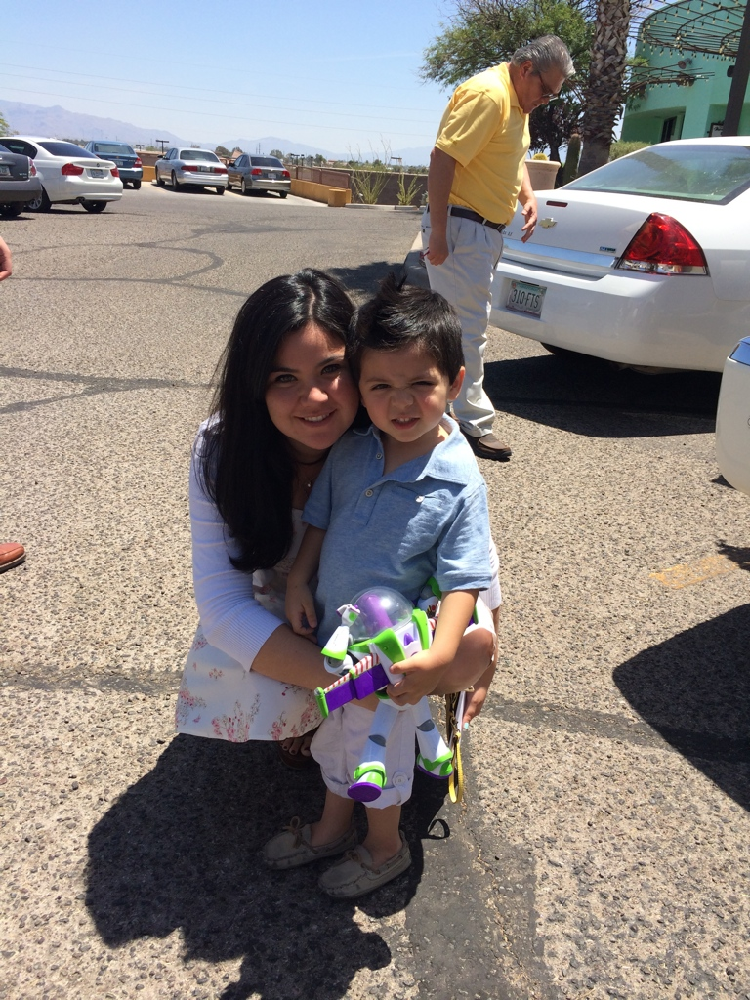

  

***

I was born and raised in a Nogales, a small border town in Arizona. At the University of Arizona I recieved a B.A. in Spanish with a concentration in linguistics and a B.S. in Speech Language and Hearing Sciences. I am currently an MA student at  the University of Arizona where I teach undergraduate-level Spanish. I enjoy playing and watching all sports, the Harry Potter series and spending time with my family (especially my nephew Carlos Mateo).